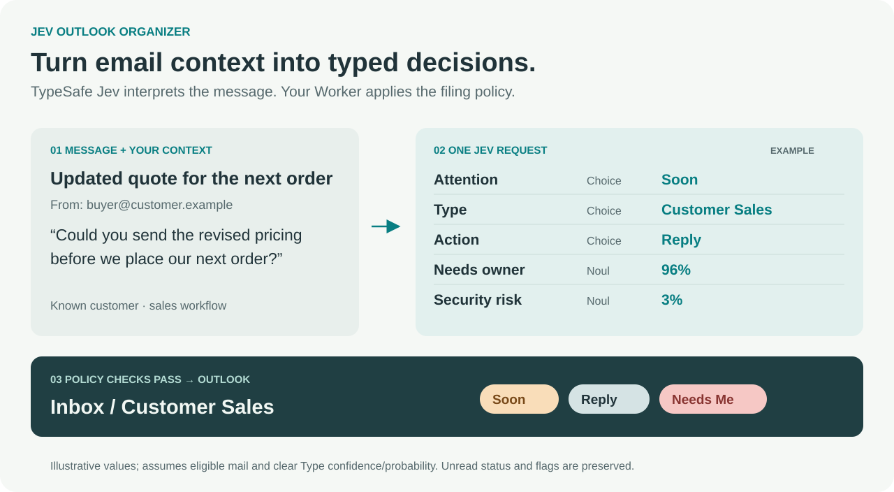
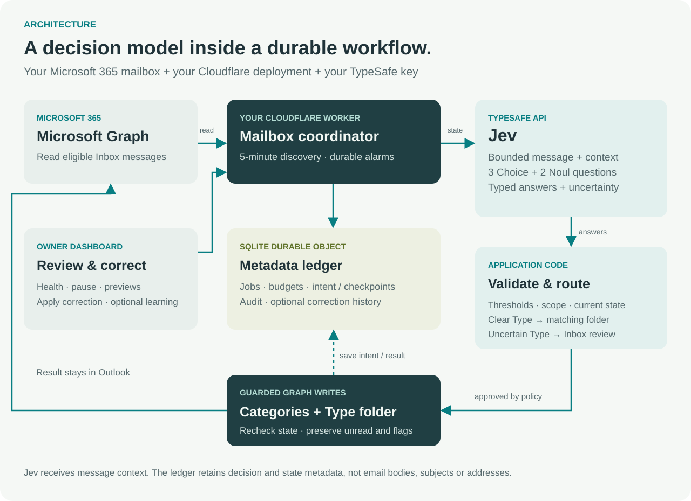
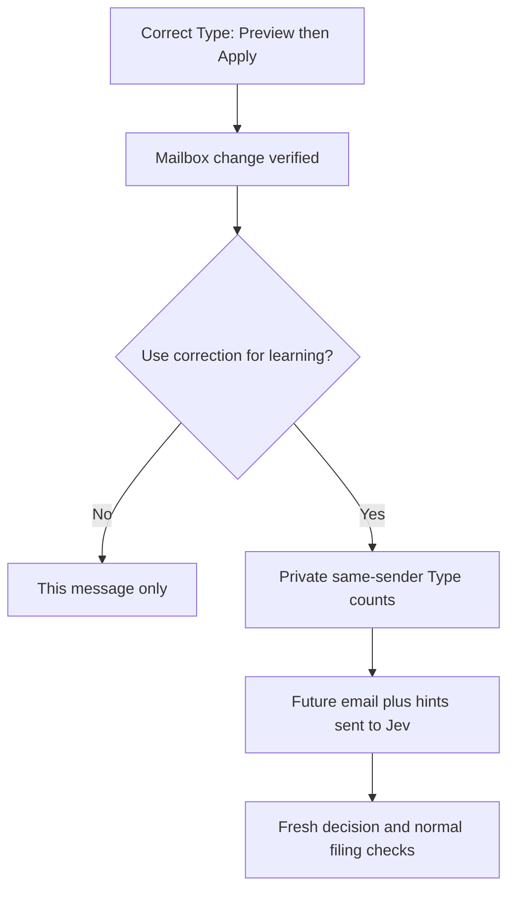

# Jev Outlook Organizer

**Turn a busy Outlook inbox into folders you understand and tasks you can see.**

A self-hosted Microsoft 365 organizer powered by [TypeSafe Jev](https://docs.typesafe.ai/). Jev reads the context and returns five typed judgments in one request. A Cloudflare Worker uses those judgments to file clear messages, keep uncertainty visible, and preserve your unread status and follow-up flags.



*Fictional email and illustrative scores, not a screenshot or measured model result. The filing example assumes the Type passes both confidence and probability thresholds.*

[**Set up your mailbox →**](docs/setup.md) · [Architecture](docs/architecture.md) · [Choose your categories](docs/configuration.md) · [Corrections & learning](docs/resilience.md)

## Why Jev fits this use case

An email can be easy to file and still need your attention. “Send the revised quote” belongs to Customer Sales; “Is this mine to handle?” and “How urgent is it?” are separate decisions. Keywords alone also miss context: a customer's invoice dispute, a purchased-software receipt and a supplier's sales pitch need different destinations.

Jev is TypeSafe's **System One model** for typed decisions inside software. This organizer asks small, explicit questions against the same message and business context, then composes the answers in code. Its three **Choice** questions return a selected option, a probability distribution and confidence. Its two **Noul** questions return probabilities from 0 to 1. [TypeSafe's primitives](https://docs.typesafe.ai/)

| Question | Jev primitive | How the organizer uses it |
| --- | --- | --- |
| **Attention** | Choice: now / soon / informational / none | Now, Soon, FYI or No Action labels; uncertainty stays visible |
| **Type** | Choice: your configured categories | Matching physical Outlook folder when filing checks pass |
| **Action** | Choice: reply / review / approve / buy / delegate / reference / archive / other | A short next-action label; an “archive” answer does not delete mail |
| **Needs owner** | Noul: probability you personally need to act | Red **Needs Me** category at 90% or higher by default |
| **Security risk** | Noul: probability the message warrants security review | Filing hold and review labels at the configured threshold |

The integration uses `@typesafe-ai/sdk`. This excerpt shows the actual boundary between model output and application policy:

```ts
// See src/jev.ts and src/taxonomy.ts for the complete implementation.
const response = await client.systemOne({
  state: prepared.state,  // Message, owner context, relationships, optional correction hints
  questions: QUESTIONS,   // Three Choice questions + two Noul questions
});
const classification = parseClassification(response.answers);
// The coordinator passes this validated result to routingPlan(...).
```

Confidence and the selected option's probability are separate checks. Typed answers make the result usable by code; correctness still needs evaluation on your mail. This project does not claim measured classification accuracy, latency or savings.

## What it looks like in daily use

**Folders answer “what is this about?” Labels answer “what should I do?”** Filed messages omit the redundant Type badge so Attention, Action and Needs Me remain readable. Optional Now / Soon / Needs Review Search Folders bring tasks together across the Type folders in classic Outlook on Windows.

| Illustrative message | Intended Type | Why context matters |
| --- | --- | --- |
| Customer asks for a revised quote | Customer Sales | A sales conversation, even if an earlier invoice is mentioned |
| Customer disputes an unpaid balance | Customer Accounting | Active billing work takes precedence over the customer default |
| Forwarded receipt for a software subscription | Receipts & Docs | Proof of purchase; forwarding does not make it customer accounting |
| Supplier asks about an active material order | Supply Chain | An existing purchase, rather than unsolicited marketing |
| Company insurance renewal needs review | Business Admin* | Company administration has a destination outside Production |
| Conference registration and travel logistics | Travel & Events* | Trip/event coordination, distinct from a paid receipt |
| Family asks about a household appointment | Personal* | Personal purpose must be supported by the content |

*Intended examples describe the category boundaries, not recorded predictions. **Choose any 2–30 Types during setup:** add, remove, rename or redefine categories to fit your mailbox. The bundled ten-category configuration and [13-category example](organizer.extended.example.json), which includes the starred folders, are editable starting points. They are not separate editions or limits. Choose your categories before first deployment; later changes to a live profile need a migration.*

In **type-folders** mode, the defaults require Type confidence **≥ 80%**, selected-Type probability **≥ 80%**, security-risk score **< 70%**, and non-truncated input. Current-state and prior-work protections also apply. An uncertain action can still be filed by a clear Type while retaining review/task labels. An uncertain Type stays in Inbox for review. [Exact routing behavior and modes](docs/operations.md)

## Architecture



1. **Discover:** a five-minute schedule finds eligible recent Inbox mail. Durable alarms continue ready work; new arrivals have priority.
2. **Judge:** the coordinator supplies a bounded message, your context and five questions to Jev. Attachments and linked pages are not fetched.
3. **Decide:** application code validates the complete response, checks confidence/risk and selects labels and a destination.
4. **Apply:** the writer records intent, rechecks mailbox state and applies guarded Graph updates. Recovery reads back uncertain outcomes before taking further action.
5. **Review:** the authenticated dashboard shows live message context, health, corrections, reclassification, retry and guarded undo.

The **SQLite Durable Object** keeps queue state, budgets, classifications, before/after metadata and audit records. It is not an email-content archive. The service runs in your Cloudflare account even when Outlook and your computer are closed. [Detailed architecture, data boundaries and code map →](docs/architecture.md)

## Corrections that inform future decisions

Pause the organizer, inspect a message's subject/sender/preview, choose **Correct Type → This belongs in…**, then **Preview → Apply**. The correction preserves task labels, unread state and flags, and records your choice separately from the model's original answer. Existing security, truncation, completion and manual-change protections still apply.



Learning supplies **Type counts from up to 20 corrected messages from the exact same sender over 180 days**. It is contextual guidance, not model fine-tuning or a forced sender rule. Undo and **Stop learning** revoke examples. It does not automatically reprocess old mail or learn from arbitrary folder moves. [Review behavior and privacy](docs/resilience.md)

## Set up your own instance

You need a **Microsoft 365 work/school mailbox**, an Exchange administrator for mailbox-scoped app access, Node.js **22.13+**, a TypeSafe Jev key and a Cloudflare account. Personal Outlook.com accounts are not supported by this app-only setup. Provider usage can incur charges.

```sh
git clone https://github.com/Taveren7/jev-outlook-organizer.git
cd jev-outlook-organizer
npm ci
npm run setup
```

`setup` creates a private local `.env` and an admin token. It does not connect to your mailbox or deploy anything.

1. **Choose your categories:** edit [organizer.config.json](organizer.config.json), or start a new installation from the [13-category example](docs/configuration.md#expanded-preset-for-a-new-installation).
2. **Connect your accounts:** follow the [full onboarding guide](docs/setup.md) for scoped Microsoft permissions and your Jev/Cloudflare credentials.
3. **Preview, then apply setup:** review folder/category creation and deployment. A new service starts **paused**.
4. **Inspect a prediction:** `npm run preview -- --latest` sends one real message to Jev and proposes changes without modifying mail.
5. **Enable deliberately:** use `npm run service -- resume --mode type-folders --limit 100` after reviewing the result. This includes unprocessed Inbox mail within your configured lookback, up to 30 days.

Existing installations should keep their configuration when updating code. A changed category profile requires a deliberate migration; copying the expanded preset over an active profile is not an upgrade procedure.

## Data, permissions and operating limits

- **Model input:** bounded message text and addressing context go to TypeSafe. Attachments and linked pages are not downloaded or analyzed.
- **Durable storage:** IDs, classifications, state metadata and optional salted sender hashes stay in your Cloudflare ledger. Email bodies, subjects and sender addresses are not persisted there. Audit metadata is still private.
- **Dashboard:** subject/sender/preview are fetched live for authenticated review, without marking messages read. Health alerts appear in the dashboard; there is no external alert channel.
- **Access:** Exchange RBAC scopes Mail.ReadWrite and MailboxSettings.ReadWrite to one mailbox. Mail.Send is unnecessary; the application does not send, delete, buy or complete tasks.
- **Control:** bounded retries, shared model-attempt budgets, provider cooldowns, a pause control and stale-state checks govern writes. A security score is a triage signal, not a malware scan.

Read [SECURITY.md](SECURITY.md), [operations](docs/operations.md) and [known follow-up work](docs/resilience.md#remaining-work). The public template uses synthetic examples; fresh-tenant onboarding and classic Outlook display should be verified in your environment.

## Explore the implementation

| Area | Entry point |
| --- | --- |
| Jev questions and response validation | [src/taxonomy.ts](src/taxonomy.ts) |
| Message/context preparation and SDK call | [src/jev.ts](src/jev.ts) |
| Queue, scheduling, budgets and review coordination | [src/production/coordinator.ts](src/production/coordinator.ts) |
| Routing and guarded mailbox writes | [src/production/core.ts](src/production/core.ts) |
| Corrections and contextual learning | [src/production/review.ts](src/production/review.ts), [learning.ts](src/production/learning.ts) |
| Preview-based onboarding | [docs/setup.md](docs/setup.md), [src/onboarding.ts](src/onboarding.ts) |

```sh
npm test
npm run typecheck
npm run test:runtime
```

Tests use synthetic mail and simulated providers. Runtime tests exercise the local Cloudflare runtime, persistence, configurable schemas, filing and recovery; they are not classifier-quality benchmarks. See [CONTRIBUTING.md](CONTRIBUTING.md).

MIT licensed. This is an independent integration using TypeSafe Jev, Microsoft Graph and Cloudflare; see [LICENSE](LICENSE).
