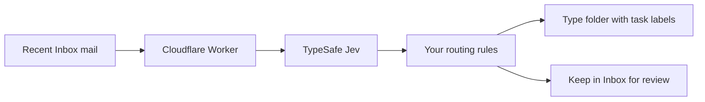

# Jev Outlook Organizer

A self-hosted Microsoft 365 email organizer. TypeSafe Jev classifies messages; a Cloudflare Worker applies your folder and category rules. Supply your own Microsoft, Jev and Cloudflare accounts.

- **Your categories:** add or remove Types, describe what belongs in each, and choose folder names and category colors in one JSON file.
- **Readable Outlook:** Type determines the folder; Attention and Action remain visible as short labels. No redundant Type badge on newly filed messages. A red **Needs Me** label highlights a high owner-action score (90% by default).
- **Preserved state:** sorting and tagging do not mark mail read, change flags, send replies or complete tasks.
- **Review first:** setup previews changes, deployment starts paused, and a single-message preview makes no mailbox changes.
- **Background operation:** five-minute Inbox discovery, a durable queue, bounded retries, provider cooldowns and an authenticated pause control.

**Requirements:** a Microsoft 365 work/school mailbox, an Exchange administrator for scoped app access, Node.js 22.13+ (24 LTS recommended), a TypeSafe Jev API key and a Cloudflare account. Personal Outlook.com accounts are not supported by this app-only setup. Provider usage can incur charges.

## Start here

```sh
git clone https://github.com/Taveren7/jev-outlook-organizer.git
cd jev-outlook-organizer
npm ci
npm run setup
```

The setup command creates a local `.env` with a random administration token, preserves existing configuration, and prints the onboarding steps. It does not connect to your mailbox or deploy anything.

1. Edit [organizer.config.json](organizer.config.json) for your context and categories.
2. Follow the [Microsoft and Cloudflare onboarding guide](docs/setup.md); put your own keys and credentials in `.env`.
3. Check access and preview folder/category creation:

   ```sh
   npm run config:check
   npm run doctor
   npm run mailbox:setup
   npm run mailbox:setup -- --apply
   ```

4. Preview deployment, then deploy paused:

   ```sh
   npx wrangler login
   npx wrangler whoami
   # Copy the account ID into CLOUDFLARE_ACCOUNT_ID in .env.
   npm run deploy
   npm run deploy -- --apply
   ```

5. Set `JEV_SERVICE_URL` from the deployment result, inspect a prediction, and explicitly enable your preferred mode:

   ```sh
   npm run service -- status
   npm run preview -- --latest
   npm run service -- resume --mode type-folders --limit 100
   ```

See the full setup guide before running these commands. `preview --latest` sends one real message to Jev and can incur usage; it never changes mail. Starting the service includes eligible Inbox messages from your configured lookback window, up to 30 days.

## The five decisions

| Decision | Meaning |
| --- | --- |
| Attention | Now, soon, informational, or none |
| Type | Your configurable business/workflow categories |
| Action | Reply, review, approve, buy, delegate, reference, archive, or other |
| Needs owner | Probability that the mailbox owner needs to act; drives the configurable Needs Me label |
| Security risk | Probability that security review is warranted |

Only Type choices are freely extensible; Attention/Action meanings stay stable while their display labels and colors are customizable. The bundled categories are examples, not a required taxonomy. [Customize your configuration](docs/configuration.md).



A Type tag does **not** always mean a message qualifies to move. By default, an uncertain Type, high security score or truncated input leaves it in Inbox with review labels. Existing managed labels, completed flags and detected manual changes are protected. [Routing and troubleshooting](docs/operations.md).

## Data and permissions

Message text and addressing context are sent to TypeSafe for classification. Attachment files and links are not fetched. The Cloudflare ledger stores IDs, classifications and before/after metadata, not email bodies, subjects or addresses. Audit metadata is still private information. This project does not provide a security scanner or a classifier accuracy guarantee.

Access uses Exchange RBAC scoped to one mailbox. Setup needs Mail.ReadWrite and MailboxSettings.ReadWrite; Mail.Send is not needed. Keep credentials out of Git. Read [security and privacy](SECURITY.md) and the [permission instructions](docs/setup.md).

## Develop

```sh
npm test
npm run typecheck
npm run test:runtime
```

Tests use synthetic data and mocked providers. The runtime suite exercises the actual local Cloudflare runtime, persistence and guarded filing. No contributor mailbox or production credentials are needed. See [CONTRIBUTING.md](CONTRIBUTING.md).

This repository has fresh public history and generic configuration. It contains no source mailbox records, deployment identifiers or private operating history. MIT licensed; see [LICENSE](LICENSE).
